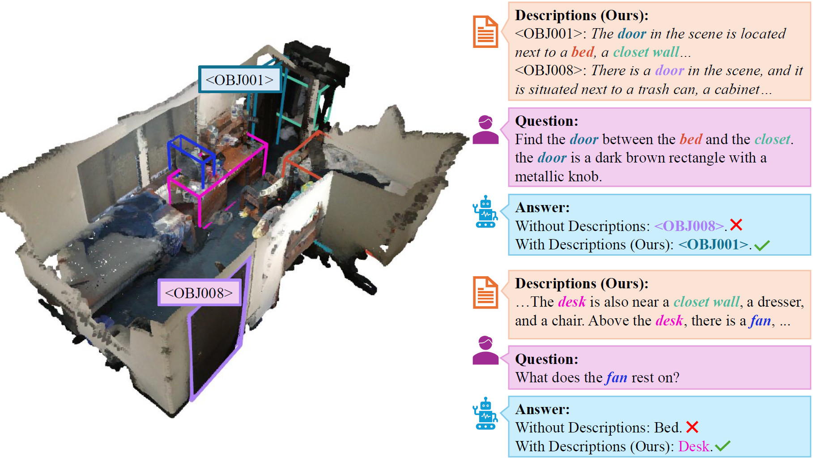

# Descrip3D: Object‑Level Text Descriptions for 3D Scene Understanding

> We add a lightweight **object-level textual relational modality** to 3D/2D object tokens and inject it at two levels, embedding fusion and prompt suffix, to boost 3D grounding, captioning, and QA without task‑specific heads.
<p align="left">
  <a href="https://arxiv.org/abs/2507.14555"></a>
  <a href="LICENSE"></a>
</p>
<p align="center">
  
</p>


## ✨ Highlights

* **Relational text for every object.** Short, auto‑generated descriptions capture appearance + spatial context.
* **Dual‑level integration.** Fuse description embeddings into object tokens and inject compressed snippets into prompts.
* **Unified pipeline.** One model handles grounding, captioning, and QA across standard ScanNet‑based benchmarks.
* **Drop‑in.** Integrates seamlessly with 3D and 2D backbones; simply attach the description branch and enable the prompt-level text injector.


## 📰 News

* **2025‑10**: 🔥 Initial code and pretrained models released. [[paper](https://arxiv.org/abs/2507.14555)]


## 🔬 Benchmarks

Descrip3D extends Chat‑Scene by introducing **object‑level textual descriptions** and **dual‑level fusion** (embedding + prompt). This simple addition yields consistent gains across multiple 3D benchmarks.

  |      	| [ScanRefer](https://github.com/daveredrum/ScanRefer) 	|         	| [Multi3dRefer](https://github.com/3dlg-hcvc/M3DRef-CLIP)	|        	|  [Scan2Cap](https://github.com/daveredrum/Scan2Cap) 	|            	| [ScanQA](https://github.com/ATR-DBI/ScanQA)  	|        	| [SQA3D](https://github.com/SilongYong/SQA3D) 	|         	|
  |:----:	|:---------:	|:-------:	|:------:	|:------:	|:---------:	|:----------:	|:------------:	|:------:	|:-----:	|:-----:	|
  |      	|  Acc@0.25 	| Acc@0.5 	|    F1@0.25   	| F1@0.5 	|  CIDEr@0.5 	| B-4@0.5 	| CIDEr 	| B-4 	|    EM  	|    EM-R  	|
  | [Chat-Scene](https://github.com/ZzZZCHS/Chat-Scene/tree/dev) 	|    55.5   	|   50.2  	|  57.1 	|  52.3  	|    77.1  	|    **36.3**    	|     87.7      	|    14.3  	|  54.6  |  57.5  |
   **Descrip3D**	|   **57.2**    	|  **51.8**   	|  **59.4**  	|  **55.1**  	|   **77.2**    	|    34.5    	|     **93.7**     	|  **14.5**  | **55.7** | **58.4** |

<small>All results are from single models without task-specific fine-tuning, using the **Vicuna‑1.5 (7B)** backbone for both Chat‑Scene and Descrip3D. The comparison is fully consistent across LLMs, ensuring fairness.‑specific fine‑tuning. </small>

## ⚙️ Installation

- Prepare the environment:
  
  ```shell
  conda create -n chat-scene python=3.9.17
  conda activate chat-scene
  conda install pytorch==2.2.1 torchvision==0.17.1 torchaudio==2.2.1 pytorch-cuda=11.8 -c pytorch -c nvidia
  pip install -r requirements.txt
  ```
  
- Download LLM backbone:
  -  We use Vicuna-7B v1.5 in our experiments, which can be downloaded from [Hugging Face](https://huggingface.co/lmsys/vicuna-7b-v1.5).

  - Change the `llama_model_path` in [run.sh](./scripts/run.sh) to the path of `vicuna-7b-v1.5`.
  

- Annotations and extracted features:
  
  Please follow the instructions in [preprocess](preprocess/).


## 🚀 Training and Inference

- Training
  - Modify [run.sh](scripts/run.sh):
    ```python
    train_tag="scanrefer#scan2cap#scanqa#sqa3d#multi3dref#nr3d_caption#obj_align"
    val_tag="scanrefer#scan2cap#scanqa#sqa3d#multi3dref"
    evaluate=False
    ```

    <details>
    <summary> Explanation of "train_tag" and "val_tag" </summary>

    - Use `#` to seperate different datasets

    - Datasets:
      - `scanrefer`: [ScanRefer](https://github.com/daveredrum/ScanRefer) Dataset
      - `scan2cap`: [Scan2Cap](https://github.com/daveredrum/Scan2Cap) Dataset
      - `scanqa`: [ScanQA](https://github.com/ATR-DBI/ScanQA) Dataset
      - `sqa3d`: [SQA3D](https://github.com/SilongYong/SQA3D) Dataset
      - `multi3dref`: [Multi3dRefer](https://github.com/3dlg-hcvc/M3DRef-CLIP) Dataset
      - `nr3d_caption`: A captioning dataset originated from [Nr3D](https://github.com/referit3d/referit3d).
      - `obj_align`: A dataset originated from ScanRefer to align the object identifiers with object tokens.

    </details>
  - Run: `bash scripts/run.sh`


- Inference
  
  - Modify [run.sh](scripts/run.sh): (We provide the pretrained checkpoint in [Google Drive](https://drive.google.com/file/d/1Ziz7Be9l6MEbn3Qmlyr9gv42C0iJQgAn/view?usp=sharing))
  
    ```python
    val_tag="scanrefer#scan2cap#scanqa#sqa3d#multi3dref"
    evaluate=True
    pretrained_path="/path/to/pretrained_model.pth"
    ```
  
  - Run: `bash scripts/run.sh`
 

## 📦 Data & Features

Follow preprocessing in [preprocess](preprocess/) to generate:
- 3D object features from [Uni3D](https://github.com/baaivision/Uni3D).
- 2D features from [DINOv2](https://github.com/facebookresearch/dinov2).
- Object‑level text descriptions from [LLaVA](https://llava-vl.github.io/).


## 📄 Citation

If you find Descrip3D helpful, please cite the paper.

```bibtex
@article{xue2025descrip3d,
  title={Descrip3D: Enhancing Large Language Model-based 3D Scene Understanding with Object-Level Text Descriptions},
  author={Xue, Jintang and Zhao, Ganning and Yao, Jie-En and Chen, Hong-En and Hu, Yue and Chen, Meida and You, Suya and Kuo, C-C Jay},
  journal={arXiv preprint arXiv:2507.14555},
  year={2025}
}
```

## 💬 Contact

If you have any questions, suggestions, or encounter issues, feel free to contact us at jintangx@usc.edu.

## 😊 Acknowledgement

Thanks to the open source of the following projects:

(Multi-modal) LLMs:
[LLaVA](https://llava-vl.github.io/),
[LLaMA](https://github.com/facebookresearch/llama), 
[Vicuna](https://github.com/lm-sys/FastChat),
[VideoChat](https://github.com/OpenGVLab/Ask-Anything/tree/main/video_chat), 
[LEO](https://github.com/embodied-generalist/embodied-generalist)

3D Datasets:
[ScanNet](https://github.com/ScanNet/ScanNet), 
[ScanRefer](https://github.com/daveredrum/ScanRefer), 
[ReferIt3D](https://github.com/referit3d/referit3d), 
[Scan2Cap](https://github.com/daveredrum/Scan2Cap), 
[ScanQA](https://github.com/ATR-DBI/ScanQA), 
[SQA3D](https://github.com/SilongYong/SQA3D), 
[Multi3dRefer](https://github.com/3dlg-hcvc/M3DRef-CLIP)

Detectors:
[PointGroup](https://github.com/dvlab-research/PointGroup), 
[Mask3D](https://github.com/JonasSchult/Mask3D),
[DEVA](https://github.com/hkchengrex/Tracking-Anything-with-DEVA)

Representations:
[ULIP](https://github.com/salesforce/ULIP), 
[Uni3D](https://github.com/baaivision/Uni3D),
[DINOv2](https://github.com/facebookresearch/dinov2)

3D Models:
[Chat-Scene](https://github.com/ZzZZCHS/Chat-Scene/tree/dev),
[vil3dref](https://github.com/cshizhe/vil3dref),
[OpenScene](https://github.com/pengsongyou/openscene)
